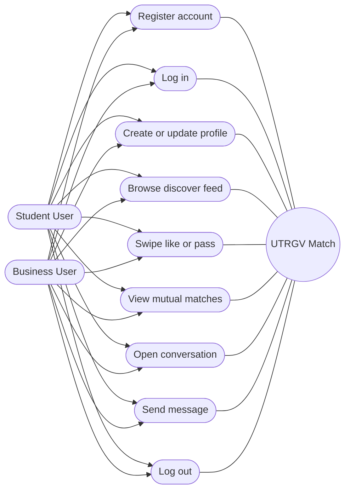
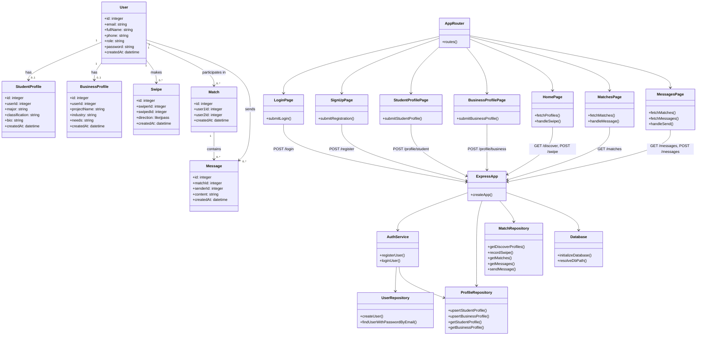
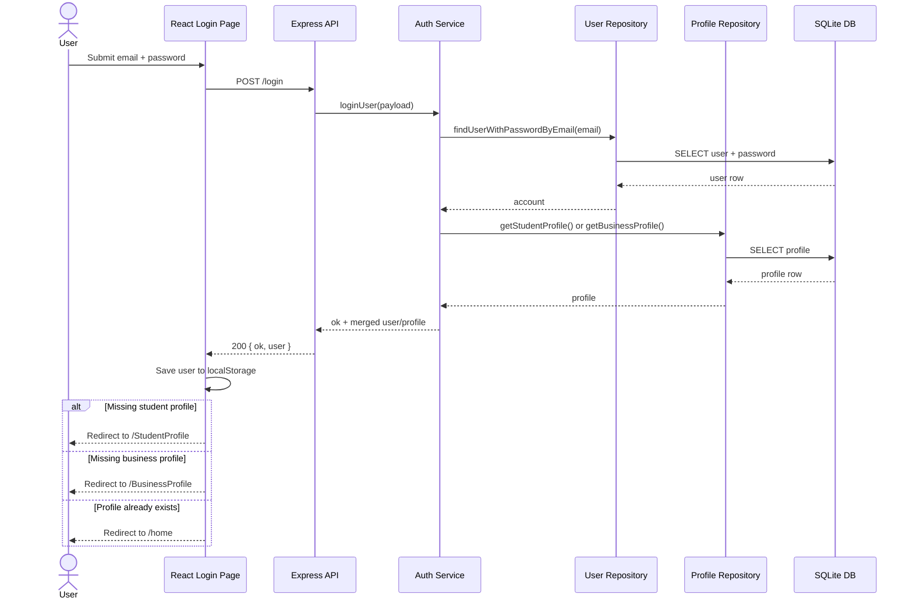
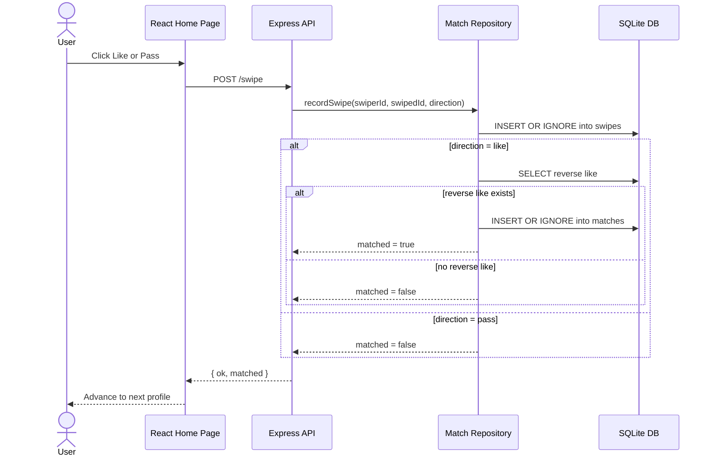
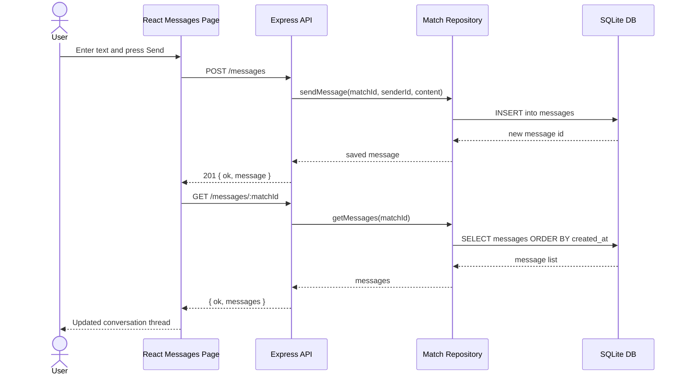

# UML Diagrams

This file combines the use case, class, and sequence UML artifacts for the current `social-app` implementation. The diagrams use Mermaid, so they render only in Markdown viewers that support Mermaid.

## Use Case Diagram

## Class Diagram

This project is not class-based in the OO sense, so the most accurate Markdown-friendly version is a Mermaid `classDiagram` showing the main data entities and backend/frontend modules.

## Sequence Diagram

## Login And Profile Routing

## Swipe To Match

## Send Message

